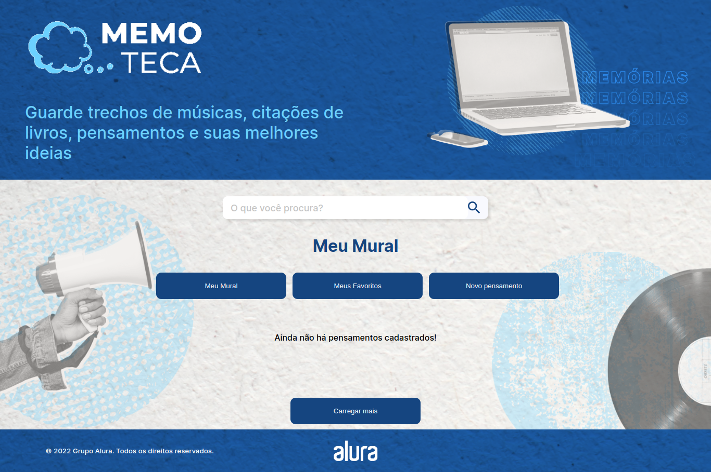

# Memoteca

Esse é um projeto desenvolvido  durante o curso da alura Angular 14: evoluindo a aplicação, que passa toda base introdutória do vue e suas funcionalidades.

## Link do Projeto
[Para acessar o link do projeto clique aqui](https://memoteca-delta.vercel.app/listarPensamento/)

## Tecnologias Utilizadas

-Angular 14

## Instalação 
- Precisara instalar global mente o json server `npm install -g json-server`
- Utilize o `npm install` para instalar as dependências do projeto

## Utilização
- Utilize o comando npm start na pasta /backend para rodar o json server
- Utilize o comando ng serve serve para rodar o projeto
